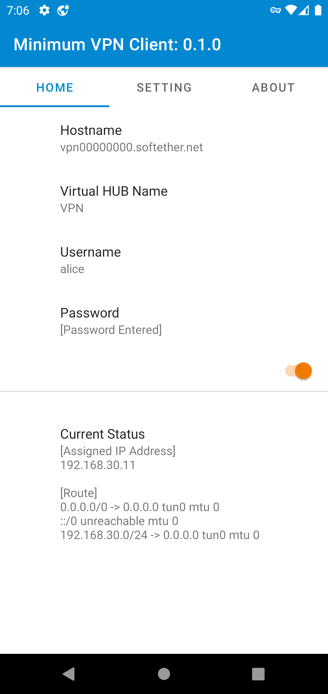

# Minimum VPN Client for SoftEther VPN
This is an open-source SoftEther-VPN-protocol-based VPN client for Android

## Notice
* "SoftEther" is a registered trademark of SoftEther Corporation
* This is an **unofficial** project. Don't ask about this app in the official forum or repository
* Currently there is **no advantage** of using this app, compared with other protocols like L2TP, OpenVPN or SSTP (see Limitation)

## What *Minimum* means?
I want to establish a VPN connection via [VPN Azure](http://www.vpnazure.net/en/)
with UDP acceleration enabled from Android. So this app's goal is to implement minimum features to do that.

## Limitation
If you satisfy the following conditions, you can establish VPN connection by TCP connection.
* The server has a global IP address
* SecureNAT is enabled
* Password authentication is enabled
* The virtual hub name is fixed to "VPN"

Since UDP acceleration is not yet implemented, this app has less performance than apps with other protocols.

## Milestones
- [x] works with a global-IP-address-assigned server
- [ ] works with VPN azure
- [ ] works with a global-IP-address-assigned server + UDP acceleration
- [ ] works with VPN azure + UDP acceleration

## Installation
You can download the latest version APK
[here](https://github.com/kittoku/Minimum-VPN-Client-for-SoftEther-VPN/releases/download/v0.1.0/mvc-0.1.0.apk).

## Screenshots
 
